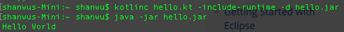

#### Install Kotlin on Mac
###### Step 1. Use Homebrew to install Kotlin
```bash
$ brew install kotlin
```

###### Step 2. Create [hello.kt](./res/hello.kt) file
```bash
$ echo "fun main(args: Array<String>) {println(\"Hello World\")}" > hello.kt
```

###### Step 3. Compile `hello.kt` with Kotlin compiler
```bash
$ kotlinc hello.kt -include-runtime -d hello.jar
```

###### Step 4. Run .jar file
```bash
$ java -jar hello.jar
```

###### Done!


ref:
1. [(在中国)执行 brew install 命令长时间卡在 Updating Homebrew 的解决方法](https://learnku.com/articles/18908)
2. [Working with the Command Line Compiler](https://kotlinlang.org/docs/tutorials/command-line.html)